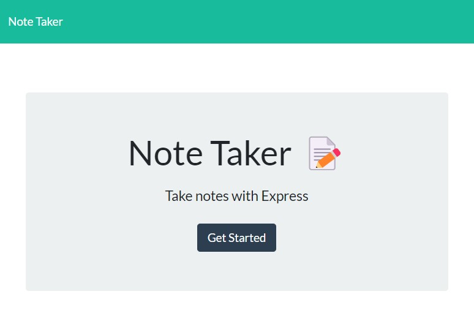
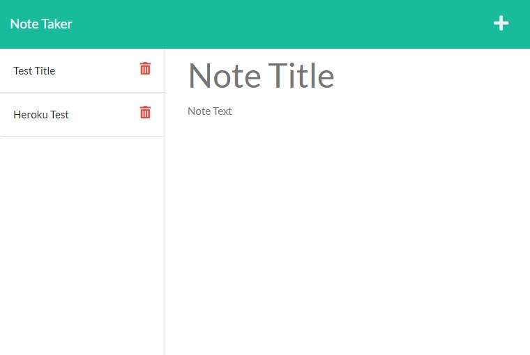

# 11-Module-Challenge

### Express.js Challenge: Note Taker

---

## Note Taker

The [Note Taker](https://gentle-harbor-10026.herokuapp.com/) application allows you to create new notes and store them in a database in order to access them later on.

---

## After entering [Note Taker](https://gentle-harbor-10026.herokuapp.com/), press *Get Started* and you will be taken to the notes page where you are able to take notes and save them.

---

## Home Page

---

## Notes Page

